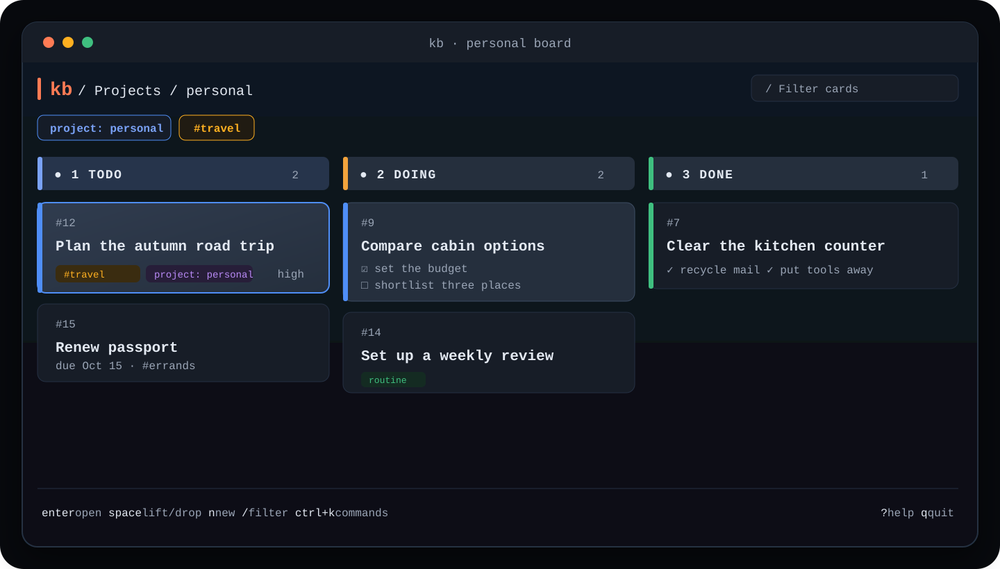

<h1 align="center">kb</h1>

<p align="center">
  A fast, local-first kanban board for your terminal.<br>
  Use the same tasks from the TUI, CLI, scripts, and AI agents.
</p>

<p align="center">
  <a href="https://github.com/RandomCodeSpace/kb/actions/workflows/quality.yml"></a>
  <a href="https://github.com/RandomCodeSpace/kb/releases/latest"></a>
  <a href="go.mod"></a>
  
</p>

<p align="center">
  
</p>

`kb` is one executable with no web UI, JavaScript bundle, hosted account, or
remote mode. Your board lives in local SQLite—no signup and no service to keep
running. Open it full-screen, automate it from the command line, or connect a
local MCP client over stdio. `kb` never listens on a TCP port.

## Why kb

- **Terminal-native:** keyboard and mouse controls, responsive columns, forms,
  filters, Markdown, comments, checklists, and blocker links.
- **Local-only:** TUI, CLI, and MCP all use the same SQLite database.
- **Scriptable:** stable task numbers, JSON output on supported commands, and a
  focused task CLI.
- **Agent-ready:** 12 MCP tools plus optional AI-assisted drafting and imports.
- **Safe task flow:** completion guards catch open checklist items and blockers;
  cancellation stays reversible until you explicitly delete a task.

## Get started

### Install with Go

Go 1.26.6 or newer is required:

```sh
go install github.com/RandomCodeSpace/kb@latest
kb version
```

### Install a release binary

CGO-free binaries for Linux amd64/arm64, macOS amd64/arm64, and Windows amd64
are attached to the [latest release](https://github.com/RandomCodeSpace/kb/releases/latest).
Download the matching binary and `SHA256SUMS`, then verify it before installing:

```sh
grep ' kb-linux-amd64$' SHA256SUMS | sha256sum -c -
```

On macOS, use `shasum -a 256 -c -`. On Windows, compare
`Get-FileHash -Algorithm SHA256` with the matching manifest entry.

Linux example after verification:

```sh
mkdir -p "$HOME/.local/bin"
install -m 0755 kb-linux-amd64 "$HOME/.local/bin/kb"
```

Make sure `$HOME/.local/bin` is on your `PATH`.

### Create your first board

```sh
kb project use personal
kb add "Write launch notes" --prio high --tag docs
kb list
kb
```

That is the whole setup. A fresh task needs a project, so the first command
saves `personal` as your default. A bare `kb` opens the TUI when run in an
interactive terminal.

Data is stored in `$KB_DATA` or `~/.local/share/kb`. To use another location:

```sh
kb tui --data /path/to/kb-data
```

## Use the board

The footer always shows actions available in the current view. These are the
keys worth learning first:

| Key | Action |
| --- | --- |
| `j`/`k`, arrows | Select a card |
| `h`/`l`, `Tab`/`Shift+Tab` | Move between columns |
| `Enter` | Open card details |
| `Space` | Lift or drop a card |
| `n` / `e` | Create / edit |
| `t` / `x` / `r` | Ship / cancel / restore |
| `/` / `f` / `X` | Text filter / label filter / clear filters |
| `p` / `P` | Next / previous project |
| `Ctrl+K` | Command palette |
| `s` | Settings |
| `?` | Full keyboard help |
| `q` | Quit |

Editors use `Tab` and `Shift+Tab` between fields and `Ctrl+S` or `Ctrl+Enter`
to save. The TUI asks before discarding changed forms. Local CLI changes appear
without restarting the board.

## Use the CLI

A normal task lifecycle stays pleasantly boring:

```sh
kb add "Ship the docs" -p web --prio high --tag release
kb list --tag project::web
# kb add prints the new task number; #12 is an example
kb view 12
kb move 12 doing
kb comment add 12 "Ready for review"
kb done 12
```

Tasks receive stable per-board numbers such as `#12`. Use bare `12`, quoted
`'#12'`, a full UUID, or a unique UUID prefix anywhere a task reference is
expected.

Useful commands:

```text
add  list  view  update  move  done  cancel  restore  rm
project  users  comment  link  unlink
```

Run `kb help` for task-command syntax and flags. Moving to Done is refused
while a task is blocked, has an incomplete checklist, or has an open linked
blocker. Use `--force` only when you mean to bypass that guard. `cancel` is
reversible; `rm ID --yes` is permanent.

### Work with projects

Projects are simple views inside one board:

```sh
kb project use web          # save the default project
kb project current
kb project list
kb add "Ship the docs"      # goes to web
kb add "Fix auth" -p api    # one-command override
kb update 12 -p api         # move task #12 to api
```

Resolution order is `-p/--project`, `KB_PROJECT`, then the saved default. Tasks
from older kb versions without a project are placed in `inbox` when a local
mode opens the store.

## Use AI and agents

AI is optional. Press `s` in the TUI to configure an OpenAI-compatible Chat
Completions endpoint, model, and API key. The endpoint must support tool calls.
Drafting, ADR splitting, and forge import show proposals for review before
creating tasks.

Built-in skills:

- `story-draft` turns rough notes into one card;
- `adr-split` turns an ADR into reviewable cards;
- `import-transform` turns GitHub or GitLab issues into reviewable cards.

Add or replace skills with direct-child Markdown files in `<data>/skills`.
Provider and forge credentials are encrypted in the local SQLite database.

### Connect an MCP client

`kb mcp` exposes the local board over stdio. It opens no network listener.

```toml
[mcp_servers.kb]
command = "kb"
args = ["mcp"]
```

The MCP process exposes task listing, creation, updates, moves, reversible
cancellation, explicit permanent deletion, similarity and duplicate checks,
task details, comments, and blocker links. It registers 12 tools and no MCP
resources.

<details>
<summary>Exact MCP tool names</summary>

```text
list_tasks        add_task          update_task       move_task
delete_task       search_similar    duplicate_check   get_task
add_comment       list_comments     link_tasks        unlink_tasks
```

</details>

## Keep your data safe

Important files in the data directory:

| Path | Purpose |
| --- | --- |
| `kb.db` | Tasks and settings |
| `kb.db-wal`, `kb.db-shm` | Active SQLite sidecars |
| `secret` | Generated key when `KB_SECRET` is unset |
| `state.json` | CLI project preference |
| `.kb-tui/` | TUI preferences |
| `skills/` | Optional custom AI skills |

### Back up

1. Quit the TUI and stop any CLI scripts or MCP clients that may be writing.
2. Copy the entire data directory as one unit—not just `kb.db`. This keeps the
   database, any SQLite sidecars, the generated `secret`, preferences, and
   custom skills together.
3. If you set `KB_SECRET` outside the data directory, preserve that exact value
   with the backup. It is part of the backup even though it is stored elsewhere.

### Restore

1. Stop every kb process that uses the destination data directory.
2. Restore the complete directory. Do not place an old `kb.db` beside a newly
   generated `secret`.
3. If the backup used an external `KB_SECRET`, restore that same value before
   starting kb.
4. Start kb normally. It validates the database schema before migration and
   refuses an existing database when its generated secret is missing, instead
   of silently creating a key that cannot decrypt the stored credentials.

Losing the generated or external key makes stored credentials unreadable. Task
content remains in SQLite, but the complete directory plus the matching secret
is the supported recovery unit.

Legacy `<user>.md` boards in the data directory are considered for one-time
import when that owner has no tasks. Use `default.md` for the board visible to
local modes. Source Markdown files are not deleted.

<details>
<summary>Environment variables</summary>

| Variable | Purpose |
| --- | --- |
| `KB_DATA` | Data directory |
| `KB_SECRET` | Encryption secret override |
| `KB_PROJECT` | Active project override |
| `KB_AI_ALLOW_PRIVATE` | Allow private AI endpoints; defaults to `1`, set `0` to block them |
| `KB_FORGE_ALLOW_PRIVATE` | Bypass the forge guard for named hosts or all hosts |
| `KB_LINK_ALLOW_PRIVATE` | Bypass the skill-link guard for named hosts or all hosts |

The three `*_ALLOW_PRIVATE` settings control separate network boundaries. AI
allows private endpoints when unset or set to `1`; set it to `0` to block them.
Forge and skill links accept a host list or `1`/`*` for all.

</details>

## Build and contribute

Build the local binary:

```sh
CGO_ENABLED=0 go build -o kb .
```

Run the test for the package or contract you changed. After committing, the
repository-owned impact calculator shows the same scope GitHub Quality will
use:

```sh
base=$(git merge-base origin/main HEAD)
sh scripts/ci/impact.sh --base "$base" --head HEAD
```

Every pull request still reports the same seven Quality jobs. Unaffected jobs
say `not affected`; affected jobs run only the owning packages and mapped
contracts. Changes to shared migrations, terminal performance, CI, docs, or
release behavior select their focused gate automatically. Node is used only by
the repository's CI monitor and is not an application build or runtime
dependency.

Use conventional commit subjects and target pull requests at `main`.

Current release notes are in
[`docs/releases/v1.6.0.md`](docs/releases/v1.6.0.md).

## License

This repository does not currently contain a project license file. Do not
assume permission to use, modify, or redistribute the code beyond rights
granted by applicable law or a separate agreement.
