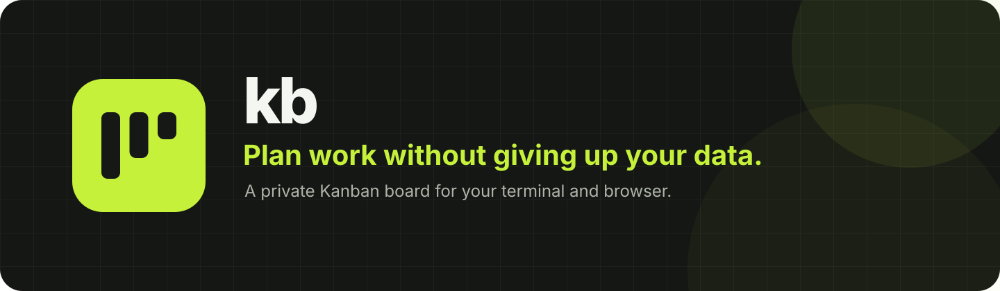
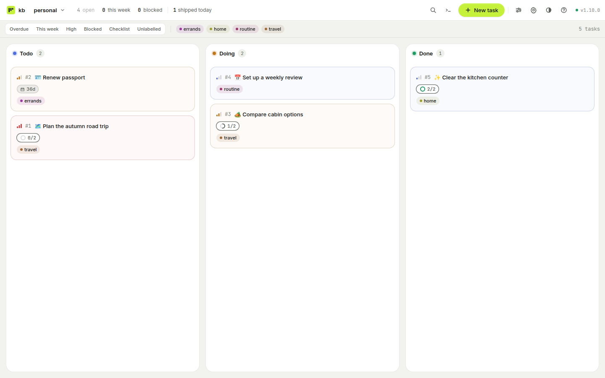

<p align="center">
  
</p>

<h1 align="center">kb: private Kanban task manager</h1>

<p align="center">
  Your task board in the terminal or browser.<br>
  No account, cloud workspace, or subscription.
</p>

<p align="center">
  <a href="https://github.com/RandomCodeSpace/kb/releases/latest"></a>
  <a href="LICENSE"></a>
  
</p>

<p align="center">
  
</p>

`kb` keeps personal projects, work tasks, and everyday to-dos on one Kanban
board. Open it as a full-screen terminal app or in your browser. Both views use
the same tasks, so you can switch without exporting or syncing anything.

Your board stays on your computer. `kb` is local-only, works without an
account, and does not send task data to a hosted kb service.

## See kb in action

### Terminal board

Use the keyboard or mouse to create tasks, move cards, filter projects, and
open task details without leaving the terminal.

<p align="center">
  
</p>

### Browser board

Prefer a visual workspace? Run `kb web` and the same board opens in your
browser. Changes appear in both views without a restart.

<p align="center">
  
</p>

<p align="center"><sub>Both images show the same example personal board.</sub></p>

## Why people use kb

- **Your tasks stay yours.** The board lives on your computer. There is no
  company account to create and no subscription to maintain.
- **Terminal or browser, your choice.** Use the fast terminal board when you
  are already at the command line, or open the browser view when you want more
  room.
- **Enough structure for real work.** Group tasks into projects and add
  priorities, due dates, labels, checklists, notes, comments, and blockers.
- **Safe by default.** Finishing a task with open checklist items or blockers
  requires an explicit override. Cancelled tasks can be restored.
- **Useful alone or with your tools.** Work by mouse and keyboard, automate
  common actions, or let an AI agent use the same board when you choose.

## Get started

### 1. Download kb

Download the current version for your computer:

| System | Download |
| --- | --- |
| Linux, Intel or AMD 64-bit | [`kb-linux-amd64`](https://github.com/RandomCodeSpace/kb/releases/latest/download/kb-linux-amd64) |
| Linux, ARM 64-bit | [`kb-linux-arm64`](https://github.com/RandomCodeSpace/kb/releases/latest/download/kb-linux-arm64) |
| macOS, Intel | [`kb-darwin-amd64`](https://github.com/RandomCodeSpace/kb/releases/latest/download/kb-darwin-amd64) |
| macOS, Apple silicon | [`kb-darwin-arm64`](https://github.com/RandomCodeSpace/kb/releases/latest/download/kb-darwin-arm64) |
| Windows, Intel or AMD 64-bit | [`kb-windows-amd64.exe`](https://github.com/RandomCodeSpace/kb/releases/latest/download/kb-windows-amd64.exe) |

Rename the downloaded file to `kb`, or `kb.exe` on Windows, make it executable
where required, and place it in a folder on your `PATH`.

<details>
<summary>Verify a download</summary>

Releases from v1.12.0 include build provenance for each binary and the
`SHA256SUMS` file. After downloading an asset, use the GitHub CLI to verify
that its bytes came from this repository's release workflow:

```sh
gh attestation verify kb-linux-amd64 --repo RandomCodeSpace/kb --signer-workflow RandomCodeSpace/kb/.github/workflows/release.yml
```

Replace `kb-linux-amd64` with your downloaded filename. The same command
verifies `SHA256SUMS`. To check a particular source revision, add
`--source-digest` followed by the full commit SHA recorded in the release.
Releases through v1.11.1 do not include these build attestations.

</details>

<details>
<summary>Install with Go instead</summary>

Go 1.26.5 is required.

```sh
GOTOOLCHAIN=local go install github.com/RandomCodeSpace/kb@latest
```

</details>

### 2. Open your board

```sh
kb
```

Press `n` to create a task. Give it a title and a project such as `personal`,
then save it. That is the whole setup.

### 3. Try the browser view

```sh
kb web
```

`kb` chooses a private local address and opens your browser. Close the command
when you are done with the web view.

## Everyday controls

The footer always shows the actions available on the current screen. These are
the useful ones to learn first:

| Key | What it does |
| --- | --- |
| `j` / `k` or arrows | Select a task |
| `h` / `l` or `Tab` | Move between columns |
| `Enter` | Open task details |
| `Space` | Pick up or drop a task |
| `n` | Create a task |
| `e` | Edit the selected task |
| `t` | Mark the selected task done |
| `/` | Search tasks |
| `p` / `P` | Move between projects |
| `Ctrl+K` | Open the command palette |
| `?` | Show all shortcuts |
| `q` | Quit |

## Keep your board private and backed up

There is no hosted account, remote mode, or build step. Your task content stays
in the kb data folder on your computer. Core task management works offline.
Optional AI tools and issue imports connect only to providers you configure.

To back up your board, close every kb process, including terminal windows,
web servers, MCP sessions, and CLI commands, then run:

```sh
kb backup ./kb-backup
```

The destination must be a new directory outside your data folder, with an
existing parent directory. kb copies the entire folder and refuses to overwrite
an existing destination, even an empty one. Use `--data <source>` to choose the
source. The default location is `$KB_DATA` when set, otherwise
`~/.local/share/kb` on Linux, macOS, and Windows. On Windows, `~` is your
user-profile folder. kb keeps the same default layout on all three platforms;
it does not use macOS Application Support or Windows AppData. Set `KB_DATA`
or pass `--data` to choose another location. Keep the folder together. Copying
only the database file can leave out information needed for a complete restore.

<details>
<summary>Backup and restore details</summary>

During the copy, kb keeps an exclusive SQLite maintenance connection open to
exclude database writers. It checkpoints committed WAL data before copying,
runs no transaction during the copy, and restores the original journal mode
afterward. Close every other kb process first; an active database connection
causes a refusal. Keep other programs from changing files in the data folder.
Symbolic links, special files, and additional links to `kb.db` are refused.

An interrupted or incomplete copy carries `.kb-backup-incomplete`. Retry into
a new destination; removing the marker does not make an incomplete backup
valid. A final filesystem-sync error can be reported after the complete copy's
marker is removed; retain the reported error and retry into a new destination.
If you use `KB_SECRET`, keep its original value separately: the environment
secret is not written into the backup. File-backed secrets are included.

To restore, copy a completed backup to a new data folder and open it with the
same or a newer kb version using `kb --data <restored-folder>`. Supply the
original `KB_SECRET` if the backup used it. Keep the original folder until you
have checked the restored board.

On opening a board, kb checks SQLite integrity before migration and refuses
empty or damaged databases, orphan database sidecars, missing required file
secrets, and marked incomplete backups. A structurally valid database cannot
reveal every omitted WAL or optional file, so always retain the whole folder.

</details>

Do not place the data folder in Dropbox, iCloud, OneDrive, or another synced
folder, and do not share one data folder between computers.

Use a local filesystem that supports file locking and hard links for the data
folder. FAT32, exFAT, and network shares are not supported data locations. On
first use, kb must publish its encryption key without replacing a key created
by another running kb process. If the filesystem cannot do that, startup fails
instead of risking unreadable saved credentials. Keep the data folder on a
supported local disk; a closed backup can be stored elsewhere.

Only `kb web` opens a TCP listener. It binds to 127.0.0.1 by default, and no
other command listens on a port. The web view has no login screen, so keep the
default local address unless you know how to protect a network service.

## Optional AI and automation

You can use kb without AI. If you choose to connect an OpenAI-compatible
provider, kb can turn rough notes into a task, split a decision document into
smaller tasks, or prepare tasks from GitHub and GitLab issues. You review the
suggestions before anything reaches your board.

The command line can create, update, move, search, finish, cancel, and restore
tasks. `kb mcp` also lets compatible AI tools work with the local board. Both
use the same data as the terminal and browser views.

<details>
<summary>Command-line example</summary>

```sh
kb add "Plan the autumn road trip" -p personal --prio high --tag travel
kb list -p personal
kb move 1 doing
kb done 1
```

Run `kb help` for the complete command reference.

</details>

<details>
<summary>CLI JSON and exit codes</summary>

### CLI JSON and exit codes

Use `--json` in scripts. Successful data goes to stdout and errors go to
stderr; human-readable tables and messages are intended for people.

Task objects always include `id`, `seq`, `emoji`, `title`, `desc`, `status`,
`blocked`, `prio`, `due`, `effort`, `tags`, `checks`, `position`, `createdAt`,
`movedAt`, and `updatedAt`. Empty strings, `false`, and `0` remain present.
`tags` and `checks` are arrays, including `[]` when empty. Each checklist
entry has `text` and `done` fields. Populated timestamps are UTC RFC3339Nano
strings.

| Command | JSON result |
| --- | --- |
| `list` | Array of tasks |
| `add`, `update`, `move`, `done`, `cancel`, `restore`, `rm` | One task |
| `view` | One task plus `blocks`, `blockedBy`, and `comments` arrays |
| `link` | Two tasks, blocker first |
| `unlink` | `{"removed":true}` |
| `comment add`, `comment rm` | One comment |
| `comment list` | Array of comments |
| `project list` | Array of objects with `project` and `tasks` |
| `users` | Array of objects with `user` and `tasks` |
| `backup` | Object with absolute destination `path` and `requiresExternalSecret` boolean |
| `version` | Object with `version` and optional `revision` and `modified` |

`blocks` and `blockedBy` contain task sequence numbers. Comment objects have
`id`, `task`, `taskId`, `author`, `body`, and `createdAt`; `task` is the sequence
number and `taskId` is the UUID.

CLI commands use these exit codes:

| Code | Meaning |
| --- | --- |
| `0` | Success or help |
| `1` | Other failure, including storage or output errors |
| `2` | Invalid arguments or flags |
| `3` | Task, comment, or link not found |
| `4` | Ambiguous reference or refused/conflicting mutation |

Code `4` includes the completion guard, a self/duplicate/cyclic link, restoring
a task that is not cancelled, a deletion missing `--yes`, and a backup refused
because its destination exists or another database connection is active.
`kb restore` accepts only cancelled tasks. Use `kb move <id> todo` to reopen a
task in another state.

Set a comment author with `kb comment add 1 "Reviewed" --author "Alice"`.
This leaves the board namespace unchanged. An omitted or blank author uses
the existing `default` author.

</details>

## Common questions

### Does kb sync between computers?

No. kb is deliberately local-only. It does not include a cloud account or
multi-device sync.

### Does kb need an internet connection?

No for the board, terminal app, browser view, and command line. Optional AI and
issue-import tools need access to the provider or forge you configure.

### Where are my tasks stored?

In the kb data folder on your computer. Every view reads the same local board.

### Which systems are supported?

Release downloads are available for Linux on amd64 and arm64, macOS on Intel
and Apple silicon, and Windows on amd64.

### Why do colors or scrolling look different over SSH?

SSH can omit the environment variables that identify your local terminal's
capabilities. For a terminal that supports true color, add a host entry to the
client's `~/.ssh/config`, replacing `kb-server` with your SSH host:

```sshconfig
Host kb-server
    SetEnv COLORTERM=truecolor
    SendEnv WT_SESSION
```

`WT_SESSION` is supplied by Windows Terminal. Forward its existing value when
using that terminal; do not invent it for another terminal. PowerShell is the
shell, so check the terminal app hosting it. Use Windows Terminal
[v1.23.20211.0 or later](https://github.com/microsoft/terminal/releases/tag/v1.23.20211.0)
for synchronized output, which groups frame updates to reduce tearing.

The SSH server must also accept these variables. Have its administrator add
this to `sshd_config`, validate and reload the SSH configuration, then reconnect:

```sshdconfig
AcceptEnv COLORTERM WT_SESSION
```

On the remote shell, `printenv COLORTERM WT_SESSION` should show `truecolor`
and, for Windows Terminal, its forwarded session value. Leave `TERM` at the
value negotiated by your terminal and SSH. Only advertise true color when the
local terminal supports it.

See OpenSSH's [SetEnv and SendEnv settings](https://man.openbsd.org/ssh_config#SetEnv)
and [AcceptEnv setting](https://man.openbsd.org/sshd_config#AcceptEnv).

## License

kb is open source under the [MIT License](LICENSE).
